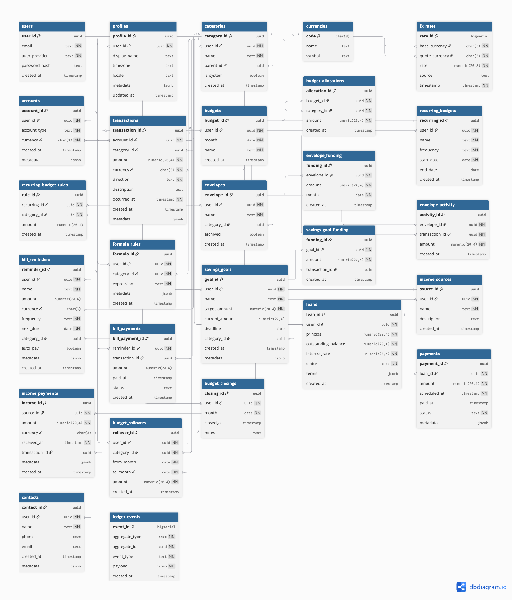

# 🏛️ Ploutos — The Personal Finance Tracker API

> **Inspired by the Greek god of wealth, Ploutos (Πλοῦτος) represents balance, control, and growth — helping users not just track where their money goes, but understand how to make it work better for them.**

## 💡 Project Overview
Ploutos is a modern, intelligent personal finance tracker built with Spring Boot that empowers users to take control of their money through structured tracking, smart insights, and automated financial summaries.

## 🗄️ Database Design
The following diagram illustrates the database schema architecture for Ploutos:



## 🚀 Features

### 👤 User Management
- JWT authentication with signup/login
- Role-based access (Admin / User)
- Profile management (preferred currency, timezone, etc.)

### 💰 Transactions
- Create, update, delete, and list transactions
- Categorize income and expenses (e.g., Food, Rent, Salary)
- Filter by date, category, or type
- Bulk import transactions from CSV (optional)

### 📊 Budgets
- Create and manage monthly budgets per category
- Track spending progress in real-time
- Get alerts when nearing or exceeding budget limits

### 📈 Analytics & Reports
- Monthly and yearly summaries
- Spending distribution charts by category
- Export financial reports (CSV or PDF)
- Email monthly summaries automatically

### ⚙️ Technical Stack
- **Backend**: Spring Boot 3.x (Java 17+)
- **Database**: PostgreSQL
- **ORM**: Hibernate (JPA)
- **Cache**: Redis
- **Authentication**: Spring Security + JWT
- **Documentation**: Swagger / OpenAPI
- **Testing**: JUnit 5 + Mockito

## 🚀 Getting Started

### Prerequisites
- Java 17 or higher
- Maven
- PostgreSQL
- Redis (for caching)

### Installation
1. Clone the repository:
   ```bash
   git clone https://github.com/Collins-01/Ploutos-backend.git
   cd ploutos
   ```

2. Configure the database in `src/main/resources/application.properties`

3. Build and run:
   ```bash
   mvn spring-boot:run
   ```

## 📚 API Documentation
API documentation is available at `http://localhost:8080/swagger-ui.html` when running locally.

## 📄 License
This project is licensed under the MIT License - see the [LICENSE](LICENSE) file for details.

## 🙏 Acknowledgments
- Inspired by the need for better personal finance management tools
- Built with ❤️ using Spring Boot
